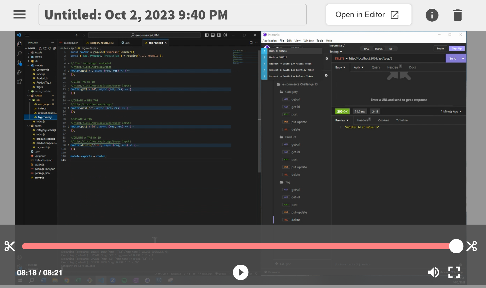

# e-commerce-ORM 

---
## Description
    
Full Stack application that allows for retail database manipulation using sequelize, express, node.js. User can view, add, delete, update databases of merchandise. 

---    
## Table of Contents

+ **[Installation](#installation)**
+ **[Usage](#usage)**
+ **[License](#license)**
+ **[Contributing](#contributing)**
+ **[Tests](#tests)**

---  
## Installation
    
npm i
node seeds/index.js
nodemon server.js

---    
## Usage
    
The reason behind the file is to display my ability to use SQL, seqeuelize, express.js, node.js, and async functions to build a user friendly application allowing for database manipulation. 

---    
## License
    
MIT

---
## Contributing
    
UDenver Bootcamp

---
## Tests

none

---
## Questions

**Contact Me:**
Email: [nick.m.fillip@gmail.com](nick.m.fillip@gmail.com)
Cell: (281) 216 - 2183
Github Profile: [https://github.com/nfillip](https://github.com/nfillip)

---

    

## Website
Github Repo: [https://github.com/nfillip/employee-tracker](https://github.com/nfillip/employee-tracker) 
Video Walk-Through: [https://drive.google.com/file/d/1566y919RTW5ukaMUxEH9IaVhHjxMj8WR/view](https://drive.google.com/file/d/1566y919RTW5ukaMUxEH9IaVhHjxMj8WR/view)

---
© 2023 nfillip LLC. All Rights Reserved.